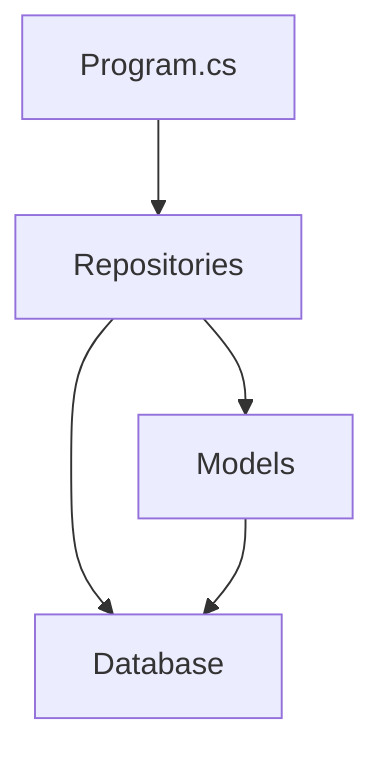

# Sistema de Gestão Comercial
> Uma solução moderna em .NET para gerenciamento de vendas e estoque

[](https://dotnet.microsoft.com/)
[](https://www.microsoft.com/sql-server)
[]()

## Grupo

- André Lambert, RM 99148

## 📋 Sobre o Projeto

Sistema desenvolvido para simplificar a gestão de pequenos e médios estabelecimentos comerciais, integrando controle de estoque, vendas e relacionamento com clientes em uma única plataforma.

### Principais Recursos

| Módulo | Descrição |
|--------|-----------|
| 🛍️ Vendas | Processamento de pedidos e gestão de transações |
| 📦 Estoque | Controle de produtos e categorias |
| 👥 Clientes | Cadastro e histórico de compras |
| 📊 Relatórios | Acompanhamento de vendas e estoque |

### Tecnologias Utilizadas

- Backend: C# / .NET 9.0
- Banco de Dados: SQL Server 2022
- Padrões: Repository Pattern, SOLID

## � Começando

### Requisitos do Sistema

- .NET 9.0 SDK
- SQL Server 2022
- Visual Studio 2025 ou VS Code

### Instalação Rápida

1. Clone o repositório:
   ```bash
   git clone https://github.com/seu-usuario/sistema-gestao-comercial.git
   ```

2. Configure o banco:
   ```bash
   # Execute o script de inicialização
   sqlcmd -S localhost -i Setup.sql
   ```

3. Execute o projeto:
   ```bash
   dotnet run --project SistemaLoja/SistemaLoja.csproj
   ```

## 🏗️ Arquitetura



### Componentes Principais

- `DatabaseConnection.cs`: Gerenciamento de conexões
- `ProdutoRepository.cs`: Operações de produtos
- `PedidoRepository.cs`: Processamento de vendas
- `Models/*.cs`: Entidades do sistema

## 📝 Notas de Uso

- As credenciais padrão do banco estão em `DatabaseConnection.cs`
- O sistema usa transações para garantir integridade dos dados
- Logs são gerados automaticamente para todas as operações


